## Лабораторная работа 1
___
Для начала стоит уточнить, что в лабораторной работе приследовалась идея сделать на основе стандартных средств Linux свою версию Docker-контейнера, все ограничения которого будут действовать внутри отдельного ограниченного процесса, запускаемового командой unshared. 

### Часть 0. Код
___
Написал на Go, потому что самый релевантный опыт был связан с ним.
Код можно посмотреть [здесь](../api/)

### Часть 1. Запуск
___
Соберем бинарник:
```bash
go build -o api
```
Запустим сервис:
```bash
./api
```
Сервис запустится по адресу localhost:8080. Проверяем эндпоинт /health:
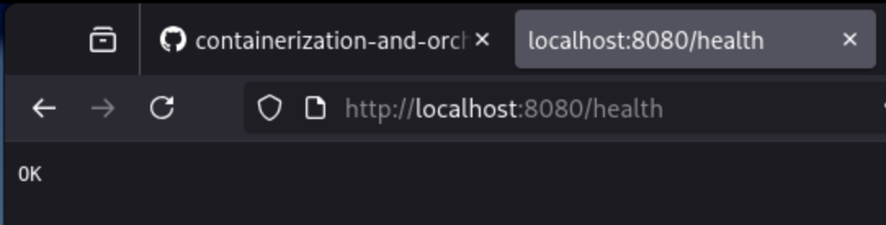

Далее посмотрим номер процесса при помощи команды `ps`:
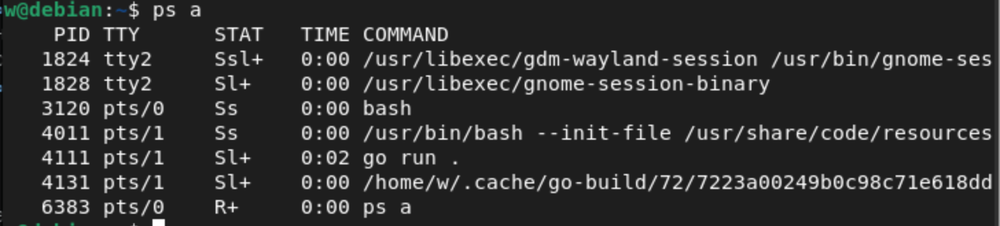

Здесь PID = 7262

### Часть 2. Выделение пространства имен
___
Выделим для нашего сервиса отдельное пространство имен:

```bash
unshare --pid --mount --net --uts --ipc --user --map-root-user --fork --mount-proc ./api
```
Найдем процесс в общем пространстве:
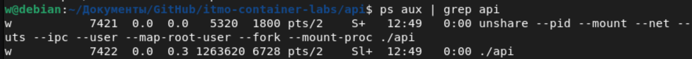

Здесь PID = 7422

Найдем этот же процесс в выделенном пространстве имен:
```bash
sudo nsenter --pid --target $PID ps -o pid,comm
```
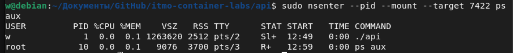

А внутри неймспейса PID=1

Изменим внутреннее название хоста контейнера для наглядности:
```bash
sudo nsenter --uts --target $PID hostname api
```

Теперь хост внутри контейнера называется api, проверим название внутреннего и внешнего хоста:
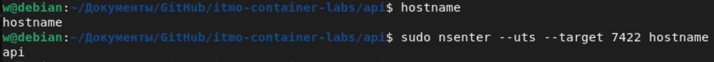

Далее проверим разделение сетевого пространства:
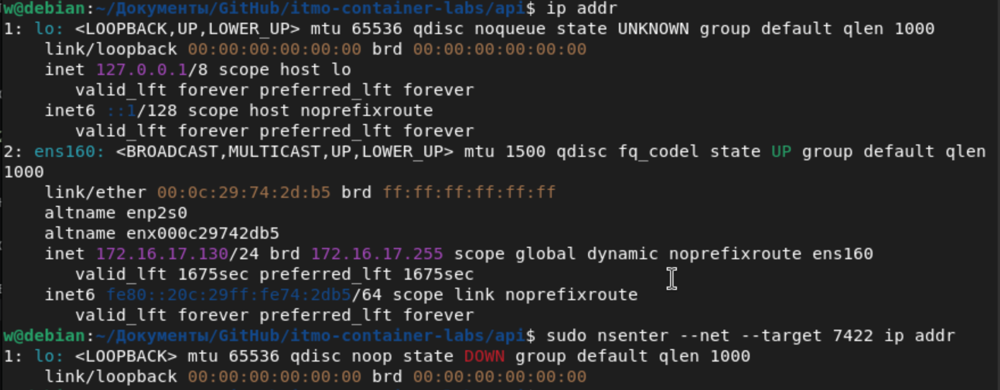

Как можно заметить, интерфейсы и их количество отличаются, что доказывает наличие изоляции.

Проверим пространство имен пользователя:
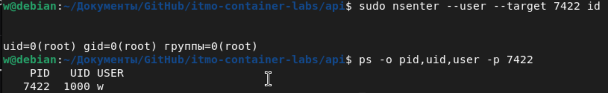

Пользователь внутри имеет uid=0 и имя root, а снаружи uid=1000 и имя w

Проверим изоляцию дискового пространства:


Сравнение ID mount namespace через /proc/7422/ns/mnt и /proc/self/ns/mnt показывает разные inode контейнера и хоста. Это доказывает изоляцию mount namespace. /proc/mounts внутри отсутствовал, так как /proc не был перемонтирован при создании namespace через unshare, поэтому для проверки использовалось сравнение inode namespace-симлинков.

Таким же образом проверим изоляцию ipcs:
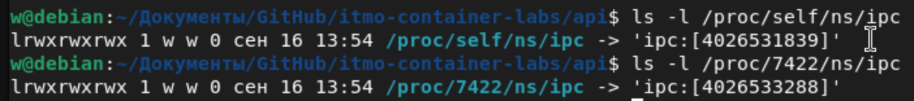

Снова пришлось смотреть по id ноды, потому что таблицы были пусты в обоих пространствах.

### Часть 3. Лимиты
___
Первично нужно создать cgroup:
```bash
sudo mkdir /sys/fs/cgroup/lab-api
echo "+memory +cpu +pids"| sudo tee /sys/fs/cgroup/cgroup.subtree_control
```

Поместим процесс в cgroup:
```bash
echo $PID | sudo tee /sys/fs/cgroup/lab-api/cgroup.procs
```

Зададим лимит памяти в 10 мегабайт:
```bash
echo "10M" | sudo tee /sys/fs/cgroup/lab-api/memory.max
```
*примерно здесь крашнулась виртуалка, поэтому PID дальше будет 13103*

Поднимаем lo:
```bash
sudo nsenter --net --target $PID ip link set lo up
```

Теперь попробуем поймать OOM:
```bash
sudo nsenter --pid --mount --net --target $PID bash -c 'exec 3<>/dev/tcp/127.0.0.1/8080; echo -e "GET /eat?mb=50 HTTP/1.0\r\n\r\n" >&3; cat <&3'
```
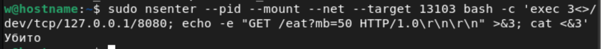

*После перезапуска PID=13934*

Поставим ограничение в 0,3 ядра:
```bash
echo "30000 100000" | sudo tee /sys/fs/cgroup/lab-api/cpu.max
```

Снова поднимаем сеть и дергаем за burn:
```bash
sudo nsenter --pid --mount --net --target  bash -c 'exec 3<>/dev/tcp/127.0.0.1/8080; echo -e "GET /burn?threads=1 HTTP/1.0\r\n\r\n" >&3; cat <&3 &'
```

Замечаем троттлинг:
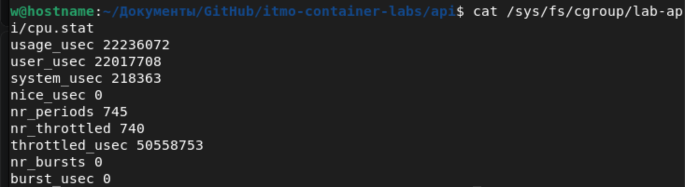

Задаем лимит процессов:
```bash
echo "15" | sudo tee /sys/fs/cgroup/lab-api/pids.max
```

Запустим форк бомбу через stress-ng:
```bash
sudo nsenter --pid --mount --net --target $PID bash -c 'stress-ng --fork 50'
```

Получаем ошибку "Ресурс временно недоступен"
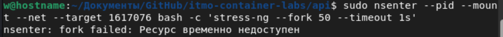

### Часть 4. Ограничение прав
___

Linux Capabilities разделяет полные права суперпользователя root на десятки мелких независимых привилегий. Сброс лишних возможностей защищает хост и контейнер от компрометации: даже если злоумышленник взломает приложение и получит внутри контейнера ID пользователя 0 (root), он не сможет взаимодействовать с аппаратным обеспечением хоста, менять время, загружать модули ядра или управлять маршрутизацией.

Чтобы оставить приложению только минимум, мы сбросим абсолютно все привилегии, кроме базовых, и проверим запрет на смену времени (системный вызов требует CAP_SYS_TIME):
```bash
sudo unshare --pid --mount --net --uts --ipc --user --map-root-user --fork --mount-proc \
capsh --caps="" -- -c "date -s '10:00:00' && ./api"
```

Закономерно получим ошибку:
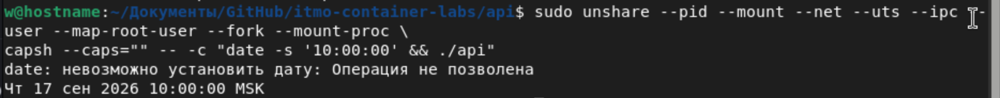

Seccomp (Secure Computing Mode) — это механизм фильтрации системных вызовов (syscalls) на уровне ядра. Он работает как белый или черный список для функций, которые приложение может запросить у ядра Linux (например, read, write, connect). Навешивание seccomp-профиля закрывает уязвимости нулевого дня в самом ядре: если в коде ядра Linux есть баг в условном вызове sys_reboot или sys_ptrace, seccomp просто не позволит процессу вызвать эту функцию, предотвращая побег из контейнера.

Для проверки работы seccomp-профиля попробуем заблокировать вызов команды mkdir, а затем, при создании контейнера сошлемся на этот фильтр и попробуем создать директорию.

Первично генерируем BPF-фильтр Seccomp через mkdirat:
```bash
enosys -s mkdirat:EPERM -d > /tmp/block_mkdir.bpf
```

Теперь запускаем создание контейнера с фильтром:
```bash
sudo unshare --pid --mount --net --uts --ipc --user --map-root-user --fork --mount-proc \
setpriv --no-new-privs --seccomp-filter /tmp/block_mkdir.bpf bash -c "mkdir test_dir && ./api"
```

Сам фильтр и его читаемый аналог в виде seccomp профиля приложил [здесь](./artefacts/).

Закономерно ловим ошибку, связанную с ограничением прав:
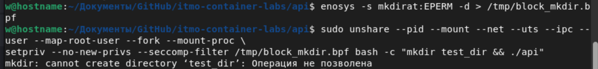

### Часть 5. Сборка докера и сравнение
___
Соберем все необходимое из частей 2-4 в один bash-скрипт. Результат можно посмотреть [здесь](./artefacts/myDocker.sh)
Скрипт должен выполняться от имени суперпользователя, так как создание cgroups и управление лимитами ядра требуют максимальных привилегий. Выдадим право на запуск скрипта и запустим его:
```bash
chmod +x myDocker.sh
sudo myDocker.sh
```

Для сравнения с запуском обычного приложения в Docker, попробуем позвонить на ручку /health обычным курлом:
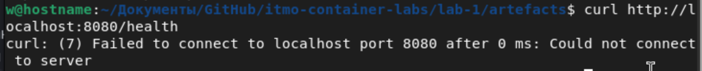

Ошибка вылетает из-за ограничения по net namespace. Так как адрес в коде api выставлен как localhost и настроена изоляция сети, сервис работает строго внутри контейнера не виден снаружи.

Доказывается это вызовом того же /health изнутри контейнера:
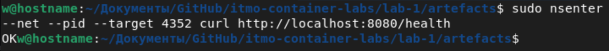

Далее напишем Dockerfile:
```Dockerfile
#создаем пустой образ
FROM scratch
#копируем бинарник
COPY api /api
#открываем порт 8080
EXPOSE 8080
#запускаем приложение
CMD ["/api"]
```

Соберем образ:
```bash
sudo docker build -t api .
```

Теперь попробуем запустить через `docker run`:
```bash
sudo docker run -d \
  --name lab-api \
  -p 8080:8080 \
  --memory="10m" \
  --cpus="0.3" \
  --pids-limit=15 \
  api
```

Теперь попробуем снова позвонить на /health извне контейнера:
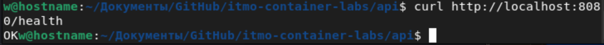

И скрипт, и `docker run` используют одинаковые механизмы и параметры ограничений ядра Linux. Однако самодельный скрипт оставляет сеть полностью запертой внутри, из-за чего внешний `curl` падает с ошибкой. В то же время Docker автоматически настраивает виртуальный мост и правила iptables для проброса порта 8080, успешно отдавая ответ наружу. Кроме того, самодельному скрипту принципиально не хватало изолированной среды — полноценной и готовой файловой системы, которую из коробки даёт Docker-образ на базе OverlayFS. Docker полностью автоматизирует рутину, избавляя от ручной записи лимитов в файлы `/sys/fs/cgroup` и сброса прав через `capsh`, заменяя эти шаги чистым слоем ФС, безопасными профилями по умолчанию и удобным интерфейсом управления контейнером.

### Часть 6. Образы
___
Так как в части 5 уже был написан и протестирован самый простой образ, предлагаю не тратить время на его повторную подготовку. Лучше отметить его главный недостаток: при малейшем изменении кода весь образ прийдется пересобирать заново. Для решения этой проблемы была придумана Multi-stage сборка.

Для ее использования нужно разделить сборку на несколько этапов:
```Dockerfile
# ЭТАП 1: Сборка (Берем тяжелый образ с Go для компиляции)
FROM golang:1.22-alpine AS builder
WORKDIR /app

# Копируем исходный код и зависимоти и компилируем бинарник прямо внутри Docker
COPY . .
RUN CGO_ENABLED=0 GOOS=linux go build -o /api .

# ЭТАП 2: Финальный запуск (чистый scratch)
FROM scratch

# Забираем готовый бинарник из первого этапа
COPY --from=builder /api /api

EXPOSE 8080
CMD ["/api"]
```
Посмотрим на статистику первой сборки:
```bash
[+] Building 107.7s (10/10) FINISHED                                         docker:default
 => [internal] load build definition from Dockerfile                                   0.0s
 => => transferring dockerfile: 216B                                                   0.0s
 => [internal] load metadata for docker.io/library/golang:1.26-alpine                 15.3s
 => [internal] load .dockerignore                                                      0.0s
 => => transferring context: 2B                                                        0.0s
 => [builder 1/4] FROM docker.io/library/golang:1.26-alpine@sha256:51a7c389a5ddaf82f  83.8s
 => => resolve docker.io/library/golang:1.26-alpine@sha256:51a7c389a5ddaf82f527191a1e  0.0s
 => => sha256:1c522d23c63ba5abba715a4b79c16b23ad435a83db46c9e74756a214b44 126B / 126B  4.9s
 => => sha256:51fb0b9b10a77a100f12ca35704e0bf2e54f625945c6087b1324 64.22MB / 64.22MB  78.0s
 => => sha256:c0a950d26132f1fa89f86eab9e0be7f020b80281607d4bd2902 249.81kB / 249.81kB  7.0s
 => => sha256:a9986cd6f37dbddae7862a6d4be71683472e7c2ea708e87db14f8a 4.19MB / 4.19MB  14.4s
 => => extracting sha256:a9986cd6f37dbddae7862a6d4be71683472e7c2ea708e87db14f8a6393c0  0.1s
 => => extracting sha256:c0a950d26132f1fa89f86eab9e0be7f020b80281607d4bd2902c7b0be586  0.0s
 => => extracting sha256:51fb0b9b10a77a100f12ca35704e0bf2e54f625945c6087b132491dec45b  5.8s
 => => extracting sha256:1c522d23c63ba5abba715a4b79c16b23ad435a83db46c9e74756a214b440  0.0s
 => => extracting sha256:4f4fb700ef54461cfa02571ae0db9a0dc1e0cdb5577484a6d75e68dc38e8  0.0s
 => [internal] load build context                                                      0.0s
 => => transferring context: 430B                                                      0.0s
 => [builder 2/4] WORKDIR /app                                                         0.7s
 => [builder 3/4] COPY . .                                                             0.1s
 => [builder 4/4] RUN CGO_ENABLED=0 GOOS=linux go build -o /api .                      7.0s
 => [stage-1 1/1] COPY --from=builder /api /api                                        0.0s
 => exporting to image                                                                 0.4s
 => => exporting layers                                                                0.3s
 => => exporting manifest sha256:8b3f5975394ea603b6917e4847a6d2cee1e09fc86660020b5e32  0.0s
 => => exporting config sha256:6f30bdcc31983f773e4bc8330adcb8bcb210156aeb9ef1ec69c7aa  0.0s
 => => exporting attestation manifest sha256:b7c7e1c7b49f92b8aab6f0b83aa3cf469fa4d334  0.0s
 => => exporting manifest list sha256:8e3339747513858994301f19996ada9c43cc085657c02a9  0.0s
 => => naming to docker.io/library/api-multi:latest                                    0.0s
 => => unpacking to docker.io/library/api-multi:latest  
```

После первичной сборки, соберем еще раз и посмотрим, как Docker переиспользует уже закешированные слои:
```bash
[+] Building 5.5s (10/10) FINISHED                                           docker:default
 => [internal] load build definition from Dockerfile                                   0.0s
 => => transferring dockerfile: 216B                                                   0.0s
 => [internal] load metadata for docker.io/library/golang:1.26-alpine                  5.4s
 => [internal] load .dockerignore                                                      0.0s
 => => transferring context: 2B                                                        0.0s
 => [builder 1/4] FROM docker.io/library/golang:1.26-alpine@sha256:51a7c389a5ddaf82f5  0.0s
 => => resolve docker.io/library/golang:1.26-alpine@sha256:51a7c389a5ddaf82f527191a1e  0.0s
 => [internal] load build context                                                      0.0s
 => => transferring context: 246B                                                      0.0s
 => CACHED [builder 2/4] WORKDIR /app                                                  0.0s
 => CACHED [builder 3/4] COPY . .                                                      0.0s
 => CACHED [builder 4/4] RUN CGO_ENABLED=0 GOOS=linux go build -o /api .               0.0s
 => CACHED [stage-1 1/1] COPY --from=builder /api /api                                 0.0s
 => exporting to image                                                                 0.0s
 => => exporting layers                                                                0.0s
 => => exporting manifest sha256:8b3f5975394ea603b6917e4847a6d2cee1e09fc86660020b5e32  0.0s
 => => exporting config sha256:6f30bdcc31983f773e4bc8330adcb8bcb210156aeb9ef1ec69c7aa  0.0s
 => => exporting attestation manifest sha256:02696606fd96502348a2d9ce41fe6d30043e33fd  0.0s
 => => exporting manifest list sha256:b43e1eb09b4152d5c6d6f1a316bf7ce5b32da3f8368b98e  0.0s
 => => naming to docker.io/library/api-multi:latest                                    0.0s
 => => unpacking to docker.io/library/api-multi:latest  
```

Как можно заметить по общей статистике вверху, с использование уже закешированных данных образ собрался в 20 раз быстрее.

Сравним размеры образов:
```sh
sudo docker image list
```
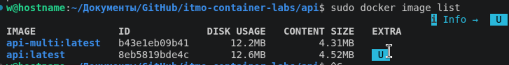

Сравним количество слоев:
```bash
sudo docker history api-multi:latest

IMAGE          CREATED          CREATED BY                  SIZE      COMMENT
b43e1eb09b41   20 minutes ago   CMD ["/api"]                0B        buildkit.dockerfile.v0
<missing>      20 minutes ago   EXPOSE [8080/tcp]           0B        buildkit.dockerfile.v0
<missing>      20 minutes ago   COPY /api /api # buildkit   7.87MB    buildkit.dockerfile.v0
sudo docker history api:latest

IMAGE          CREATED       CREATED BY                 SIZE      COMMENT
8eb5819bde4c   3 hours ago   CMD ["/api"]               0B        buildkit.dockerfile.v0
<missing>      3 hours ago   EXPOSE [8080/tcp]          0B        buildkit.dockerfile.v0
<missing>      3 hours ago   COPY api /api # buildkit   8.09MB    buildkit.dockerfile.v0
```

Как можно заметить по выводу docker history, физическое количество слоев у обоих образов идентично (всего 1 значимый слой с бинарником), однако размер слоя мульти-стейдж сборки оказался чуть меньше (7.87MB против 8.09MB у сингл-стейджа). Данная разница обусловлена условиями компиляции: при ручной сборке сингл-образа на хосте бинарник компилируется с флагами по умолчанию, включая в себя отладочные символы и динамические линки (CGO). В то же время, внутри изолированного этапа builder в Multi-stage сборке флаг CGO_ENABLED=0 и оптимизированная среда компилятора Go генерируют максимально чистый, чисто статический бинарник без лишних метаданных, что делает итоговый образ еще более легковесным.

Теперь попробуем загрузить какой-нибудь файл внутрь контейнера.

Для начала его необходимо запустить:
```bash
sudo docker run -d --name api-no-volume api-multi
```

Теперь попробуем переместить во внутрь какой-нибудь файл:
```bash
echo "данные без тома" > /tmp/test-file.txt
sudo docker cp /tmp/test-file.txt api-no-volume:/file.txt
Successfully copied 29B (transferred 2.05kB) to api-no-volume:/file.txt
```

Проверим, что данные действительно скопировались:
```bash
sudo docker cp api-no-volume:/file.txt /tmp/check-file.txt
Successfully copied 29B (transferred 2.05kB) to /tmp/check-file.txt
cat /tmp/check-file.txt 
данные без тома
```

Теперь пересоздадим контейнер:
```bash
sudo docker rm -f api-no-volume
sudo docker run -d api-multi
```
И попробуем вытащить оттуда перемещенный файл:
```bash
sudo docker cp api-multi:/file.txt /tmp/file2.txt
Error response from daemon: Could not find the file /file.txt in container api-no-volume
```

Ожидаемо, файл на томе не сохранился. Теперь попробуем провернуть все тоже самое, но с томом.

Первично создадим том:
```bash
sudo docker volume create api-volume
```

Теперь запустим контейнер с флагом -v, аргументом к которому укажем название нашего тома:
```bash
sudo docker run -d --name api-with-volume -v api-volume:/data api-multi:latest
```

Запишем данные:
```sh
echo "эти данные выживут" > /tmp/test-volume.txt
sudo docker docker cp /tmp/test-volume.txt api-with-volume:/data/save.txt
Successfully copied 35B (transferred 2.05kB) to api-with-volume:/data/save.txt
```

Пересоздадим контейнер:
```sh
sudo docker rm -f api-with-volume
sudo docker run -d --name api-with-volume -v api-volume:/data api-multi
```

Вытащим файл из контейнера и прочтем:
```sh
sudo docker cp api-with-volume:/data/save.txt /tmp/result-file.txt
cat /tmp/result-file.txt
эти данные выживут
```

При полном уничтожении и повторном разворачивании контейнера подключенный том мгновенно смонтировал сохраненное состояние, и файл save.txt был успешно прочитан, что доказывает персистентность томов.

### Часть 7. gVisor

Далее сравним работу стандартного Docker контейнера с `--runtime=runsc`. Так как обычный Docker уже запускался с лимитами `cpu=0,3 mem=10M pids=15`, попробуем запустить с такимиже лимитами контейнер с `runsc`:
```bash
sudo docker run -d \
  --runtime=runsc \
  --memory="10m" \
  --cpus="0.3" \
  --pids-limit=15 \
  api-multi
``` 

Закономерно получаем ошибку создания рантайма:
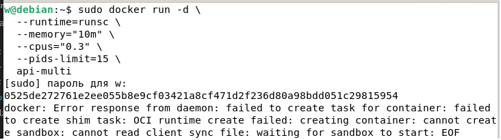

Теперь попробуем расширить лимиты и запустить Docker с изоляцией:
```bash
sudo docker run -d \
  --runtime=runsc \
  --memory="100m" \
  --cpus="1" \
  --pids-limit=100 \
  api-multi
```