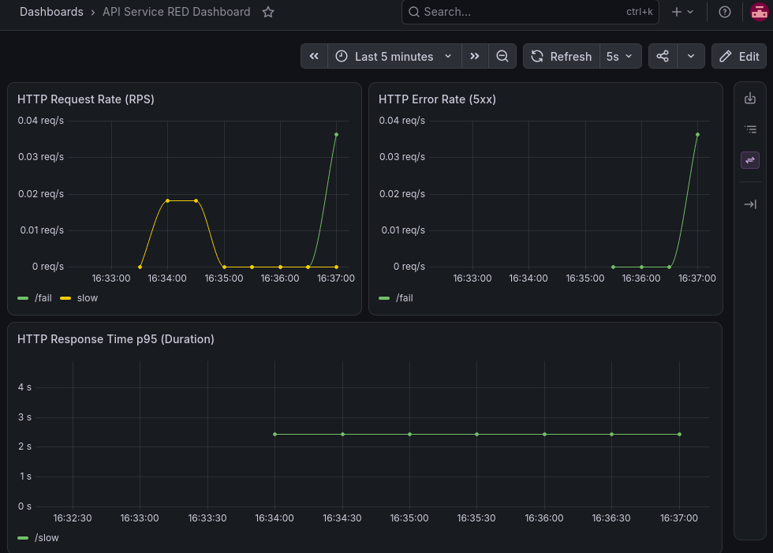
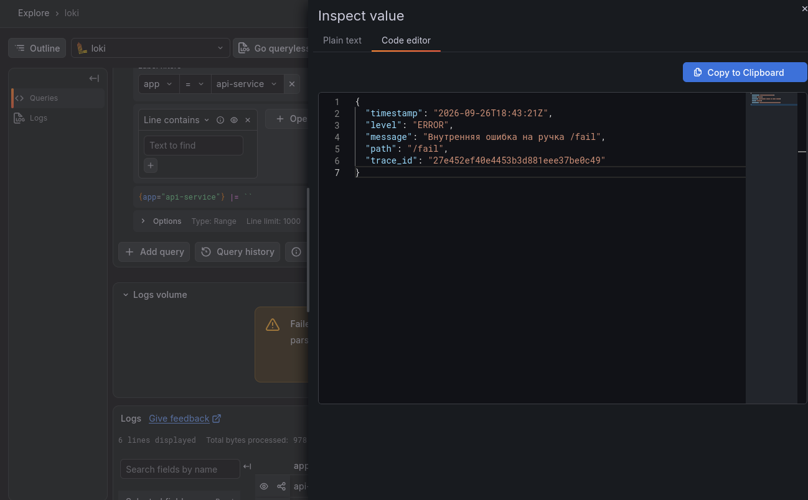
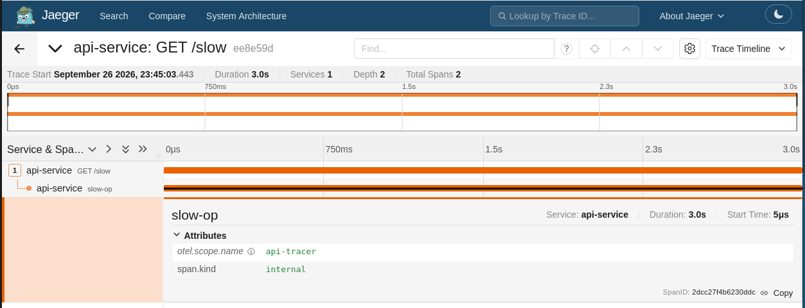
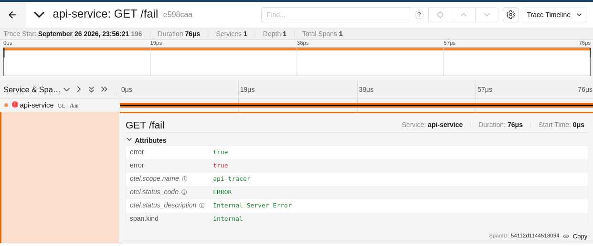
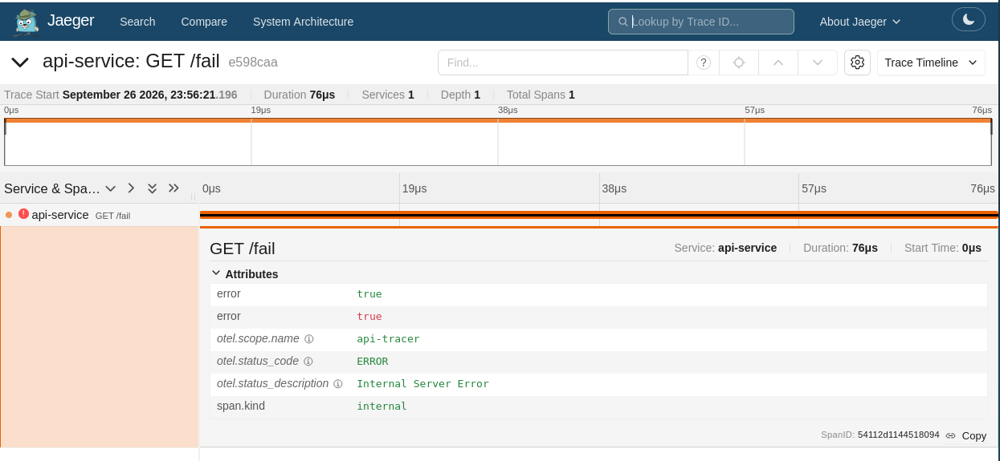
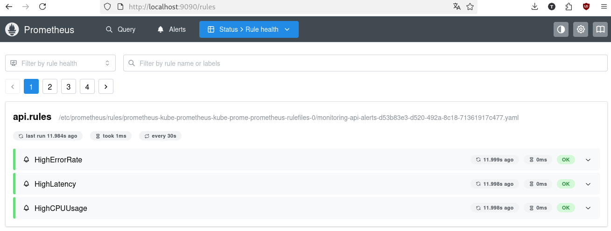
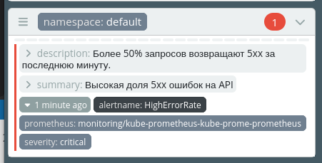
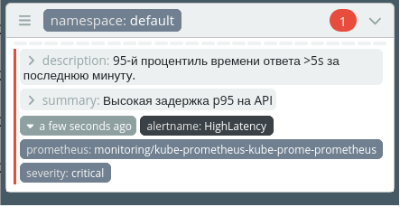
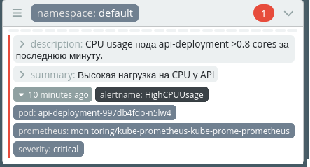

## Лабораторная работа 2
___
Целью работы является поднять полный стек мониторинга, настроить трейсинг и алерты.
### Часть 0. Подготовка
___
Для начала, добавим в код стандартных ручек телеметрию.
Затем, подредактируем Dockerfile, добавив в него:
```Dockerfile
COPY go.mod go.sum ./
RUN go mod download
```

И соберем образ:
```bash
sudo docker build -t api:v1 .
```

Теперь надо настроить Кубер-кластер. Для выполнения работы я выбрал minikube:
Установим Kubernetes и Minikube, а затем запустим с драйвером Docker:
```sh
minikube start --vm-driver=docker
```

Добавим аддон ingress, чтобы в дальнейших частях лабы открывать дашборды Grafana, Jaeger и Karma прямо через браузер на хосте:
```sh
minikube addons enable ingress
```

Теперь просто загрузим уже собранный ранее образ:
```sh
minikube image load api-multi:latest
```

Далее установим Helm и создадим чарт для нашего сервиса:
```sh
helm create api-chart
```

Удалим стандартные шаблоны и создадим наш:
```sh
rm -rf api-chart/templates/*
nano api-chart/templates/api.yaml
```

Содержимое манифеста можно посмотреть [здесь](../api/api-chart/templates/api.yaml)

Установим наш сервис:
```sh
helm install my-api ./api-chart
```

Получим:
```sh
NAME: my-api
LAST DEPLOYED: Sat Sep 26 01:05:48 2026
NAMESPACE: default
STATUS: deployed
REVISION: 1
DESCRIPTION: Install complete
TEST SUITE: None
```

### Часть 1. Метрики
___
Зададим пространство имен для мониторинга:
```sh
kubectl create namespace monitoring
```

Добавим репозиторий стека мониторинга:
```sh
helm repo add prometheus-community https://prometheus-community.github.io/helm-charts
```

Создадим чарт для Prometheus, [содержимое](../api/prometheus/values.yaml)

Теперь установим в наш кластер:
```sh
helm install kube-prometheus prometheus-community/kube-prometheus-stack   --namespace monitoring   -f api/prometheus/values.yaml
```

Получаем:
```sh
NAME: kube-prometheus
LAST DEPLOYED: Sat Sep 26 01:57:09 2026
NAMESPACE: monitoring
STATUS: deployed
REVISION: 1
DESCRIPTION: Install complete
TEST SUITE: None
```

Добавим в наш манифест параметры мониторинга:
```yaml
annotations:
    prometheus.io/scrape: "true"
    prometheus.io/port: "8080"
    prometheus.io/path: "/metrics"
```

Применим его:
```sh
helm upgrade my-api ./api/api-chart
```

Финально, пробросим порты для сервиса и мониторинга:
```sh
kubectl port-forward svc/api-service 8080:8080
kubectl port-forward svc/kube-prometheus-grafana -n monitoring 3000:80
```

Создадим дашборды [RED-метрик](../api/api-chart/templates/red-dashboard.yaml), апгрейднимся и посмотрим, как они реагируют на использование ручек:


### Часть 2. Логи
___
Установим Loki при помощи команды:
```sh
helm repo add grafana https://grafana.github.io/helm-charts
helm repo update
helm install loki grafana/loki-stack -n monitoring -f api/loki/values-loki.yaml
```

Содержимое [values-loki.yaml](../api/loki/values-loki.yaml)

Ставим старый loki-stack(loki+promtail), так как новый Loki при запуске падает и не удается его починить.

Фиксируем наличие логов:


### Часть 3. Трейсинг
___

Напишем [манифест](../api/jaeger/values-jaeger.yaml) и установим Jaeger:
```sh
helm repo add jaegertracing https://jaegertracing.github.io/helm-charts
helm repo update

helm install jaeger jaegertracing/jaeger -n monitoring -f api/jaeger/values-jaeger.yaml
```

Посмотрим, на каких портах открылись экспортеры:
```sh
kubectl logs -n monitoring -l app.kubernetes.io/name=jaeger --tail=50 | grep -i -E "otlp|4317|4318"

2026-09-26T19:03:03.637Z	info	otlpreceiver@v0.160.0/otlp.go:120	Starting GRPC server	{"resource": {"service.instance.id": "9430dc39-e19d-47fc-bf49-531b29549bb6", "service.name": "jaeger", "service.version": "v2.21.0"}, "otelcol.component.id": "otlp", "otelcol.component.kind": "receiver", "endpoint": "[::]:4317"}
2026-09-26T19:03:03.638Z	info	otlpreceiver@v0.160.0/otlp.go:175	Starting HTTP server	{"resource": {"service.instance.id": "9430dc39-e19d-47fc-bf49-531b29549bb6", "service.name": "jaeger", "service.version": "v2.21.0"}, "otelcol.component.id": "otlp", "otelcol.component.kind": "receiver", "endpoint": "[::]:4318"}
```

Теперь добавим env в Deployment-чарт приложения:
```yaml
env:
  - name: OTEL_EXPORTER_OTLP_ENDPOINT
    value: "http://jaeger.monitoring.svc.cluster.local:4318"
  - name: OTEL_SERVICE_NAME
    value: "api-service"
```

Теперь надо его протестировать, дернем /slow, посмотрим трассировку:


Посмотрим также трассировку /fail:


Возьмем traceId из лога Grafana:
```json
{
  "timestamp": "2026-09-26T20:56:21Z",
  "level": "ERROR",
  "message": "Внутренняя ошибка на ручка /fail",
  "path": "/fail",
  "trace_id": "e598caa7357fc7cc5a4bdf0d4fe68b1f"
}
```

Найдем тот же трейс в Jaeger:


### Часть 4. Alertmanager
___
Установим Alertmanager:
```sh
helm upgrade kube-prometheus prometheus-community/kube-prometheus-stack -n monitoring -f alertmanager-values.yaml
```

Напишем [манифест](../api/alertmanager/values-alertmanager.yaml), алерты настроим на почту и [правила алертинга](../api/alertmanager/api-alerts.yaml) и применим их:
```sh
kubectl apply -f api-alerts.yaml
```
Выбрал три алерта, которые покрывают три уровня деградации сервиса. HighErrorRate фиксирует функциональный отказ: доля ответов 5xx выше 50% за 1 минуту означает, что больше половины пользователей не получают результат, что означало бы реальные потери для компании. HighLatency ловит производительную деградацию по p95 выше секунды - взял малый интервал, так как в среднем запрос летит намного быстрее. На повышение времени запроса нужно реагировать немедленно, так как это напрямую влияет на пользовательский опыт. HighCPUUsage с порогом 0.8 ядра даёт сигнал: под подходит к лимиту, начинается CFS throttling, растут очереди — и если не среагировать здесь, масштабированием или увеличением лимита, можно предотвратить переход сервиса в состояния, описываемые первыми двумя алертами.

Пробросим порты, зайдем в панель Prometheus и увидим, что алерты подхватились:


Напишем небольшой [манифест](../api/karma/values-karma.yaml) и установим Karma:
```sh
helm install karma wiremind/karma -n monitoring -f api/karma/values-karma.yaml
```

Подергаем ручку /fail, /slow и /burn, чтобы затриггерить алерты, и посмотрим на них в дашборде:






### Итог
___

Лабораторная дала мне представление о том, как поднимается и работает стек наблюдаемости и увидеть, как связываются метрики, алерты, логи и трейсы. По ходу дела столкнулся с кучей реальных граблей: несовместимость версий Grafana и Loki, неверное имя job в scrape-конфиге, периодически отлетающий Prometheus — каждая такая проблема сначала казалась тупиком, но в итоге помогала понять, как инструмент устроен изнутри и как поддерживать его работу.

Лаба однозначно была полезной также и для разработчика: интересно было посмотреть, как телеметрия добавляется в код и в дальнейшем скрейпится Прометеем.