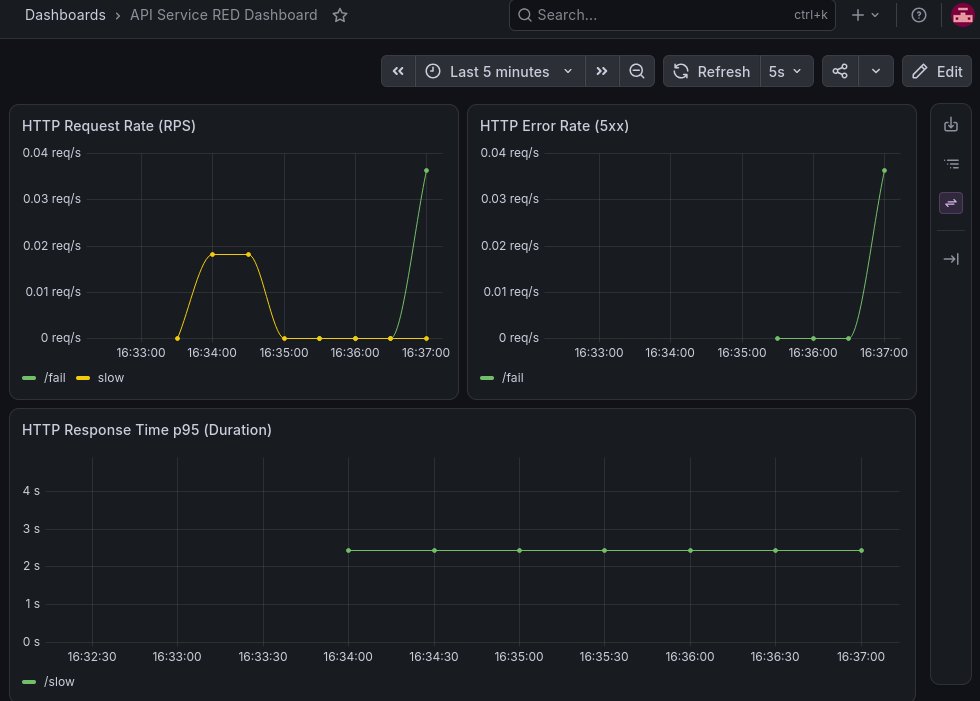

## Лабораторная работа 2
___
Целью работы является поднять полный стек мониторинга, настроить трейсинг и алерты.
### Часть 0. Подготовка
___
Для начала, добавим в код стандартных ручек телеметрию.
Затем, подредактируем Dockerfile, добавив в него:
```Dockerfile
COPY go.mod go.sum ./
RUN go mod download
```

И соберем образ:
```bash
sudo docker build -t api:v1 .
```

Теперь надо настроить Кубер-кластер. Для выполнения работы я выбрал minikube:
Установим Kubernetes и Minikube, а затем запустим с драйвером Docker:
```sh
minikube start --vm-driver=docker
```

Добавим аддон ingress, чтобы в дальнейших частях лабы открывать дашборды Grafana, Jaeger и Karma прямо через браузер на хосте:
```sh
minikube addons enable ingress
```

Теперь просто загрузим уже собранный ранее образ:
```sh
minikube image load api-multi:latest
```

Далее установим Helm и создадим чарт для нашего сервиса:
```sh
helm create api-chart
```

Удалим стандартные шаблоны и создадим наш:
```sh
rm -rf api-chart/templates/*
nano api-chart/templates/api.yaml
```

Содержимое манифеста можно посмотреть [здесь](../api/api-chart/templates/api.yaml)

Установим наш сервис:
```sh
helm install my-api ./api-chart
```

Получим:
```sh
NAME: my-api
LAST DEPLOYED: Sat Sep 26 01:05:48 2026
NAMESPACE: default
STATUS: deployed
REVISION: 1
DESCRIPTION: Install complete
TEST SUITE: None
```

### Часть 1. Метрики
Зададим пространство имен для мониторинга:
```sh
kubectl create namespace monitoring
```

Добавим репозиторий стека мониторинга:
```sh
helm repo add prometheus-community https://prometheus-community.github.io/helm-charts
```

Создадим чарт для Prometheus, [содержимое](../api/prometheus/values.yaml)

Теперь установим в наш кластер:
```sh
helm install kube-prometheus prometheus-community/kube-prometheus-stack   --namespace monitoring   -f api/prometheus/values.yaml
```

Получаем:
```sh
NAME: kube-prometheus
LAST DEPLOYED: Sat Sep 26 01:57:09 2026
NAMESPACE: monitoring
STATUS: deployed
REVISION: 1
DESCRIPTION: Install complete
TEST SUITE: None
```

Добавим в наш манифест параметры мониторинга:
```yaml
annotations:
    prometheus.io/scrape: "true"
    prometheus.io/port: "8080"
    prometheus.io/path: "/metrics"
```

Применим его:
```sh
helm upgrade my-api ./api/api-chart
```

Финально, пробросим порты для сервиса и мониторинга:
```sh
kubectl port-forward svc/api-service 8080:8080
kubectl port-forward svc/kube-prometheus-grafana -n monitoring 3000:80
```

Создадим дашборды [RED-метрик](../api/api-chart/templates/red-dashboard.yaml), апгрейднимся и посмотрим, как они реагируют на использование ручек:



